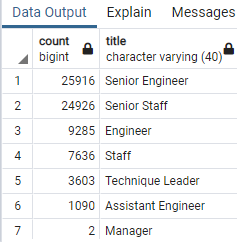
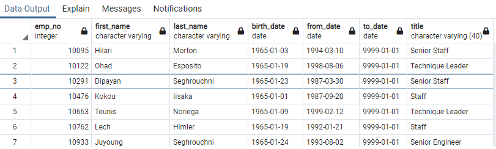

# Pewlett-Hackard-Analysis

## Overview

This project is a basic analysis of employee data in a PostgreSQL database. Given the number of records involved, the data from our csv files was imported into Postgres in order to quickly and efficiently manipulate the data. Using SQL queries we selected the data we were interested in, and exported it to csv using the pgAdmin export tool.

### Purpose

The purpose of this analysis is to get information on the upcoming 'silver tsunami' at the company Pewlett-Hackard (PH). PH is a mature company and has been around for quite some time. Many employes are getting close to retirement age, and the leadership at PH needs information on those employees. Additionally, they need to get an overview of how many job positions and titles will be opening up so they can be prepared to fill those vacancies. The leadership at PH also brought up the idea of starting a mentorship program to help soon-to-be-retiring employees train the ones that will be taking their places. 

## Results

### Background

> \
>Figure 1.

> \
>Figure 2.

Figure 1 is a count of the number of employees ready for retirement, grouped by job title. Figure 2 is a list of employees who would be eligible to participate in the mentorship program. Overall there are 240,124 employees currently employed with PH, as found by the following query.
```
SELECT count(em.emp_no)
FROM employees AS em
INNER JOIN dept_emp as de
ON (em.emp_no = de.emp_no)
WHERE (to_date = '9999-01-01')
```

<!-- Provide a bulleted list with four major points from the two deliverables -->
### Major Points

* Two managers are retiring, which will leave PH with no currently employed managers
* As is expected, most of the employees retiring are in senior level positions. 
* The number of employees eligibility for mentoship is quite small in comparison to the total number of employees.
* With this many employees leaving for retirement it may be a good time to look at reorganizing the company.

## Summary
<!-- Provide high level responses to these questions, and provide two additional queries or tables that may provide more insight into the upcoming 'silver tsunami' -->

<!-- How many roles will need to be filled as the "silver tsunami" begins to make an impact? -->
### How many roles will need to be filled as the "silver tsunami" begins to make an impact?
As these employees begin to retire they will leave around 70,000 positions vacant, as shown in figure 1. The majority of these will be senior level positions, and some of those senior level positions will assumedly be filled by promotions from lower level employees. With the opening of so many positions it will also be a good time to look at how many of those positions are necessary to the company. It's possible that some of those vacancies won't need to be filled, but that still leaves a very large number of people that need to be hired. HR is going to become very busy soon.

<!--  Are there enough qualified, retirement-ready employees in the departments to mentor the next generation of Pewlett Hackard employees? -->
### Are there enough qualified, retirement-ready employees in the departments to mentor the next generation of Pewlett Hackard employees?
Figure 2 shows part of a list of employees eligible for the mentorship program, but not a count of how many that is, or what positions they are in. So we'll get that information using this query:
```
SELECT COUNT(title), title FROM mentorship_elegibility 
GROUP BY title ORDER BY count DESC
```
There are only about 1,500 employees eligible for the mentorship program, and that does not seem to be enough to train enough new employees to fill the gap that will be left by the "silver tsunami". Just looking at Senior Engineers, that's a ratio of 60:1 open spots to eligible mentors. Pewlett-Hackard is going to have to start hiring now to fill these future vacancies. 

### Additional Queries

Another table that would be helpful in getting additional insight into this problem would be a table that has the amount of time each employee has been with the company. Many retirement benefits require a certain amount of years worked in order for the employee to be eligible for them. All 70,000 of the employees from figure 1 might not be ready to retire yet.

Additionally, a table listing the salaries of those from figure 1 would bring good information for the company. This many retirements and new hires are going to mean a lot of changing salaries, and PH needs to be ready to pay the next generation of employees. 
